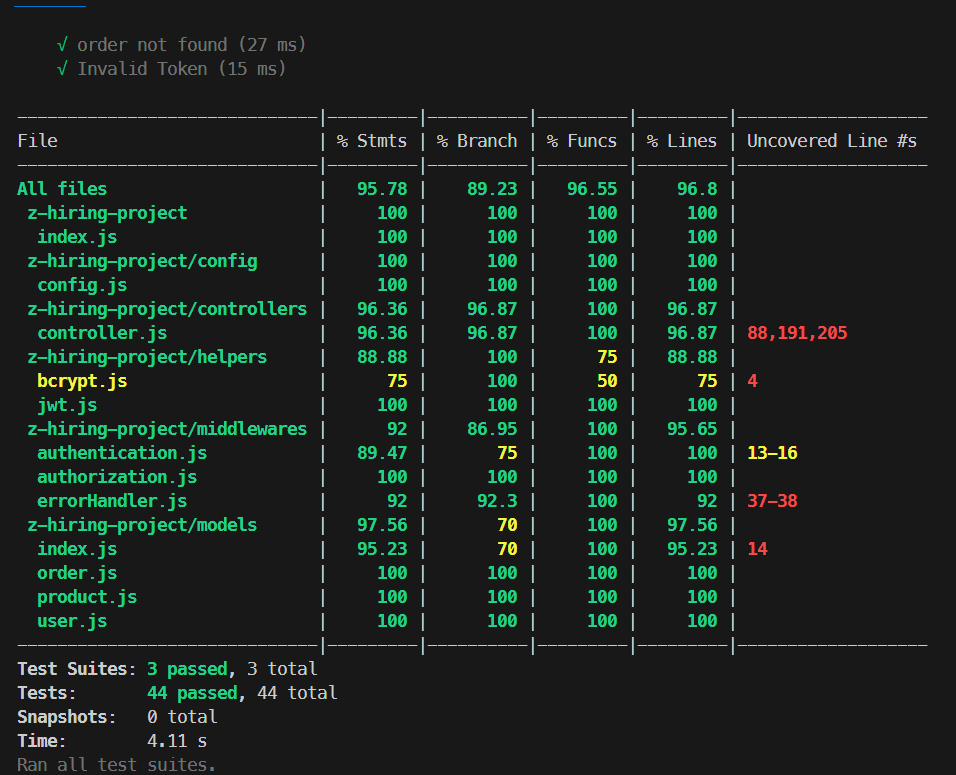

# 10xers Documentation

- [API Documentation](API.md) (offline)
- [API Documentation](https://documenter.getpostman.com/view/32679813/2sA3BuXUUW) (online)(more detailed)
  

## Prerequisites

- Node.js
- PostgreSQL

## Installation

1. Clone the repository:

```console
git clone <repository-url>
```

2. Navigate to the project directory:

```console
cd 10xers
```

## Server

### Installation

- npm install

Create a `.env` file in the server directory with the following content:

```dosini
# Express Server
PORT=your_port (default: 3000)
JWT_SECRET=your_jwt_secret

# Sequelize Database Development
DEV_DB_USERNAME=your_dev_db_username
DEV_DB_PASSWORD=your_dev_db_password
DEV_DB_NAME=your_dev_db_name
DEV_DB_HOST=your_dev_db_host

# Sequelize Database Test
TEST_DB_USERNAME=your_test_db_username
TEST_DB_PASSWORD=your_test_db_password
TEST_DB_NAME=your_test_db_name
TEST_DB_HOST=your_test_db_host
```

4. Create a PostgreSQL database for development

```console
npx sequelize-cli db:create
```

5. Run the migrations

```console
npx sequelize-cli db:migrate
```

6. Seed the database

```console
npx sequelize-cli db:seed:all
```

7. Start the server:

```console
npm start
```

8. The server will be running on

```console
http://localhost:3000
```

### Testing

The server has unit tests written with Jest. To run the tests, use the following command:

Create a PostgreSQL database for testing

```console
npx sequelize-cli db:create --env test
```

Run the migrations

```console
npx sequelize-cli db:migrate --env test
```

Start the server:

```console
npm test
```

to check the coverage:

```console
npx jest --coverage --runInBand --forceExit --detectOpenHandles --verbose
```

## Account Testing

- Email: user1@example.com
- Password: 123456

---

- Email: user2@example.com
- Password: qwerty
